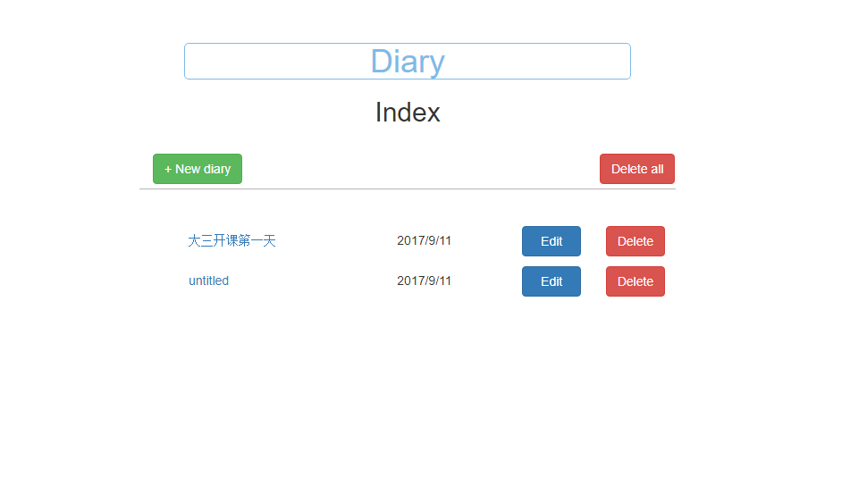

# diary
A simple diary app built with Express.js, Pug and MongoDB

## Screenshot

## Use
### Clone this repo and `cd` to the `diary` directory
  `git clone https://github.com/enzeberg/diary.git`
  `cd diary`
### Install static resources
  `cd public`
  `bower install`
### Install Node dependencies
  `cd ..`
  `npm install`
### Run the app
- Start MongoDB
  `mongod`
- Start the server
  `npm start`
### Access `http://localhost:3000`

## License
MIT
